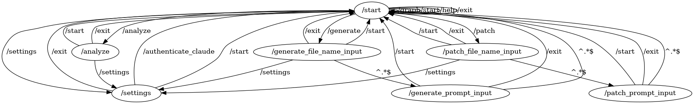

# GPT Morph CLI Bot

The GPT Morph CLI Bot is a command-line interface (CLI) bot powered by OpenAI's GPT-3.5 or Anthropic's Claude. It allows you to interact with the GPT model to generate text and perform various tasks through a console-based interface.

## Features

- **Text Generation:** You can use this bot to generate text based on your input and project requirements.
- **Settings Display:** Check and display your OpenAI API key settings.
- **Graph Visualization:** View a Graphviz representation of the bot's API.

## Installing the GPT Morph CLI
```shell
pip install git+https://github.com/pysyun/python_gptmorph_cli.git
```


## How code morphing works

Code morphing utilizes large language models (LLMs) like GPT-3.5, LLAMA or Claude to analyze and modify source code. It takes as input the original code as well as a natural language description of the desired changes.

1. The system first tries to deeply understand the existing code - its structure, intent, logic, dependencies, etc. It builds an abstract representation of the code.

2. Next, it interprets the natural language prompt to determine the required modifications - adding/removing functions, changing algorithms, updating APIs, etc.

3. It then generates new code by combining its understanding of the original code with the requested edits. The system is constrained to keep existing code structure and behavior unchanged where possible.

4. Finally, it outputs the modified code with the changes applied. The programmer can then review, test, and integrate the morphs.

By leveraging the understanding and generative abilities of LLMs, code morphing automates lower-level coding tasks so developers can focus on high-value priorities. The morphs act as a starting point that developers can further refine.

## Glossary

Here's a brief explanation of the terms "**morphs**", "**morpher**", and "**morphing**" in the context of **code morphing**:
 
- The **MORPHS** refer to the outputs of the code morphing process - the modified code containing the requested changes. The morphs are the code snippets, files, or components that have been automatically transformed by the system.
- The **MORPHER** is the core component that performs the morphing operation. It is the code morphing system, algorithm, or model (like GPT-3.5) that analyzes the code and generates the morphs. The morpher could be thought of as the "engine" that powers code morphing.
- **MORPHING** is the process of automatically modifying the source code according to the requested changes. It involves the morpher understanding the existing code, interpreting the desired edits, and outputting the morphs. Morphing is the application of the morpher to transform code from one state to another per the prompts.

In summary:

**MORPHS** are the outputs - the modified code files and components.

The **MORPHER** is the code morphing model or system carrying out the morphing process.

**MORPHING** is the act of automatically transforming the code by applying the **MORPHER** to generate morphs.

So **CODE MORPHING** leverages the **MORPHER** to perform **MORPHING** on source code and produce useful **MORPHS** for developers.

## Getting Started

To get started with the **GPT Morph CLI Bot**, follow these steps:

1. Install it using PIP as described above.

2. Navigate in BASH (it can be your IDE's console) to your project.

3. Configure the Large Language Model (LLM, ChatGPT, Claude, ...).

    2.1. To use OpenAI for morphing, you need to have the OpenAI API Key in the ".env" file.
    
    2.2. Or, set up your OpenAI API Key for a new project:

        - Create a file named ".env" in the project folder.
        - Open the .env file and add the following line:
          ```
          OPENAI_API_KEY=<YOUR_API_KEY>
          ```
        - Replace `<YOUR_API_KEY>` with your actual OpenAI API key.
        - Save the .env file.

    If you don't have an OpenAI API key yet, sign up at [OpenAI Platform](https://platform.openai.com/signup).

    2.3. Or, authenticate to **Anthropic Claude API** by using the [Python Claude Web Authenticator](https://github.com/pysyun/python_claude_web_authenticator).

        - Start the "mrph" shell.
        - Type "/settings".
        - Type "/authenticate_claude".
        - Proceed to signing into https://claude.ai/ to get your API key automatically on successful sign-up.

4. Run the bot:
    ```shell
    mrph
    ```

5. You will be prompted with a main menu that allows you to choose different options, such as text generation, settings display, and more.

## Using the "mrph" CLI

- To analyze project code, choose the "**/analyze**" option and follow the prompts.
- To generate new code artifacts, select the "**/generate**" option and follow the prompts.
- To modify existing code artifacts, select the "**/patch**" option and follow the prompts.
- To view your LLM key settings, select the "**/settings**" option.
- Explore other available commands in the main menu.

You can find example bot sessions, showing how to do something good at: 
[GPT Morph CLI Bot Examples](./examples.md)

## BASH Bot API graph

[morph.dot](./flows/morph.dot)

## Contributions

Contributions to this project are welcome. Feel free to open issues, submit pull requests, or suggest improvements.

## License

This project is licensed under the LGPL License - see the [LICENSE](LICENSE) file for details.

## Acknowledgments

- This project uses **OpenAI's GPT-3.5** for text generation.
- This project uses **Anthropic Claude** for text generation.

Enjoy using the GPT Morph CLI Bot!
