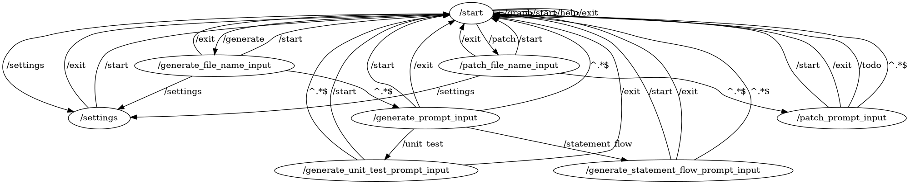

# GPT Morph CLI Bot

      **MORPHING** is the act of automatically transforming the code by applying the **MORPHER** to generate **MORPHS**.
      
      Andrew. (2023). *The Large Language Model code morphing*. Andrew's Blog. Retrieved 2023-11-12, from [https://andrewmikhailov.wordpress.com/2023/11/12/code-morphing/](https://andrewmikhailov.wordpress.com/2023/11/12/code-morphing/)

The GPT Morph CLI Bot is a command-line interface (CLI) bot powered by a local llama.cpp endpoint, Ollama, or OpenAI. It allows you to interact with the LLM to generate text and perform various tasks through a console-based interface.

## GPT Morph Status
✅ `Llama.cpp API` (local Tesla K80 inference) active.

✅ `Ollama API` active.

✅ `ChatGPT API` active.

## Installing the GPT Morph CLI
```shell
pip install git+https://github.com/pysyun/python_gptmorph_cli.git --upgrade --break-system-packages
```


## How code morphing works

Code morphing utilizes large language models (LLMs) like GPT-3.5, LLAMA or Claude to analyze and modify source code. It takes as input the original code as well as a natural language description of the desired changes.

1. The system first tries to deeply understand the existing code - its structure, intent, logic, dependencies, etc. It builds an abstract representation of the code.

2. Next, it interprets the natural language prompt to determine the required modifications - adding/removing functions, changing algorithms, updating APIs, etc.

3. It then generates new code by combining its understanding of the original code with the requested edits. The system is constrained to keep existing code structure and behavior unchanged where possible.

4. Finally, it outputs the modified code with the changes applied. The programmer can then review, test, and integrate the morphs.

By leveraging the understanding and generative abilities of LLMs, code morphing automates lower-level coding tasks so developers can focus on high-value priorities. The morphs act as a starting point that developers can further refine.

GPT Morph's distinguishing trait is that it loads the **whole project** as the LLM context for every morph, rather than retrieving snippets or compressing history like other coding assistants. See [`documentation/modeling-approach.md`](./documentation/modeling-approach.md) for the full explanation.

## Glossary

Here's a brief explanation of the terms "**morphs**", "**morpher**", and "**morphing**" in the context of **code morphing**:
 
- The **MORPHS** refer to the outputs of the code morphing process - the modified code containing the requested changes. The morphs are the code snippets, files, or components that have been automatically transformed by the system.
- The **MORPHER** is the core component that performs the morphing operation. It is the code morphing system, algorithm, or model (like GPT-3.5) that analyzes the code and generates the morphs. The morpher could be thought of as the "engine" that powers code morphing.
- **MORPHING** is the process of automatically modifying the source code according to the requested changes. It involves the morpher understanding the existing code, interpreting the desired edits, and outputting the morphs. Morphing is the application of the morpher to transform code from one state to another per the prompts.
- **CLI bot**, or command-line interface bot, is a bot or assistant program designed to be interacted with via a text-based command-line or terminal interface rather than a graphical user interface.

In summary:

**MORPHS** are the outputs - the modified code files and components.

The **MORPHER** is the code morphing model or system carrying out the morphing process.

**MORPHING** is the act of automatically transforming the code by applying the **MORPHER** to generate **MORPHS**.

So **CODE MORPHING** leverages the **MORPHER** to perform **MORPHING** on source code and produce useful **MORPHS** for developers.

## Getting Started

To get started with the **GPT Morph CLI Bot**, follow these steps:

1. Install it using PIP as described above.

2. Navigate in BASH (it can be your IDE's console) to your project.

3. Configure the Large Language Model (LLM, ChatGPT, Claude, ...).

    2.1. To use OpenAI for morphing, you need to have the OpenAI API Key in the ".env" file.
    
    2.2. Or, set up your OpenAI API Key for a new project:

        - Create a file named ".env" in the project folder.
        - Open the .env file and add the following line:
          ```
          OPENAI_API_KEY=<YOUR_API_KEY>
          ```
        - Replace `<YOUR_API_KEY>` with your actual OpenAI API key.
        - Save the .env file.

    If you don't have an OpenAI API key yet, sign up at [OpenAI Platform](https://platform.openai.com/signup).

    2.3. Or, point the bot at a local **llama.cpp** endpoint (for example, the Tesla K80 inference node) by adding to the ".env" file:

        ```
        LLAMA_CPP_ENDPOINT_URI=<YOUR_ENDPOINT_URI>
        LLAMA_CPP_MODEL=<YOUR_MODEL_NAME>
        ```

    2.4. Or, point the bot at an **Ollama** endpoint by adding to the ".env" file:

        ```
        OLLAMA_ENDPOINT_URI=<YOUR_ENDPOINT_URI>
        OLLAMA_MODEL=<YOUR_MODEL_NAME>
        ```

    2.5. **Multi-agent setup (many processor instances).** You can define any number
    of *named* processor instances and run several of them in parallel — for example
    several local llama.cpp nodes on your network. Each instance is a block of
    `MRPH_PROCESSOR_<ID>_*` variables in the ".env" file:

        ```
        MRPH_PROCESSORS=k80-a,k80-b,gpt4

        MRPH_PROCESSOR_k80-a_TYPE=llama_cpp
        MRPH_PROCESSOR_k80-a_ENDPOINT_URI=http://192.168.0.14:8080/v1
        MRPH_PROCESSOR_k80-a_MODEL=k80-model

        MRPH_PROCESSOR_k80-b_TYPE=llama_cpp
        MRPH_PROCESSOR_k80-b_ENDPOINT_URI=http://192.168.0.15:8080/v1
        MRPH_PROCESSOR_k80-b_MODEL=k80-model

        MRPH_PROCESSOR_gpt4_TYPE=openai
        MRPH_PROCESSOR_gpt4_API_KEY=<YOUR_API_KEY>
        MRPH_PROCESSOR_gpt4_MODEL=gpt-4o
        ```

    Supported `TYPE` values are `llama_cpp`, `ollama` and `openai`. Recognised
    per-instance keys are `TYPE`, `ENDPOINT_URI`, `MODEL`, `API_KEY` and `BASE_URL`.
    `MRPH_PROCESSORS` is optional and only fixes the id ordering (the first id is the
    default). The classic single-instance variables above keep working and map to the
    default ids `llama_cpp`, `ollama` and `openai`. Run `/settings` to list everything
    that is configured.

4. Run the bot:
    ```shell
    mrph
    ```

5. You will be prompted with a main menu that allows you to choose different options, such as text generation, settings display, and more.

## Features

- **Text Generation:** You can use this bot to generate text based on your input and project requirements.
- **Re-factoring**.
- **Unit testing**.
- **Settings Display:** Check and display your configured LLM settings.
- **Graph Visualization:** View a Graphviz representation of the bot's API.

## Extending the LLM text corpus

To morph projects, which are developed using rare programming languages, rare technical approaches or internal libraries, it is possible to extend the LLM's text corpus using the:

[`.corpora`](./corpora.md) folder.

## Using the "mrph" CLI

- To generate new code artifacts, select the "**/generate**" option and follow the prompts.
- To modify existing code artifacts, select the "**/patch**" option and follow the prompts.
- To view your configured processor instances, select the "**/settings**" option.
- Explore other available commands in the main menu.

### Choosing processors (multi-agent morphing)

Both `/generate` and `/patch` accept a processor identifier so you can pick which
instance — or how many — perform the morph:

- `/generate` — ride the round-robin pool: whichever configured processor is
  free next (spread evenly across the pool; with a single processor
  configured this is just that one processor, as before).
- `/generate @k80-a` — use the processor with id `k80-a`.
- `/generate @k80-a,@gpt4` — run both **in parallel**; each writes its own morph to
  `<name>.<id>.<ext>` so you can compare the results.
- `/generate @all` — fan the morph out across **every** configured processor at once.

The same `@id` syntax works for `/patch`. When several processors are selected they
are dispatched concurrently, letting you use many parallel local nodes on your
network as a multi-agent system.

That feature fans *one* file out across many processors. For the opposite
case, a plain `/generate` (no `@id`) rides a round-robin pool: type a
*sequence* of independent `/generate` calls, each a different file, and
they are picked up automatically by whichever configured processor is
free — up to as many files morphing concurrently as you have processors —
queuing once every slot is busy and dispatching automatically as each
processor frees up. `/settings` shows each processor's idle/busy status and
how many jobs are queued. See
[`documentation/parallel-generate-scheduling.md`](./documentation/parallel-generate-scheduling.md)
for the full behaviour.

You can find example bot sessions, showing how to do something good at: 
[GPT Morph CLI Bot Examples](./examples.md)

## BASH Bot API graph

[morph.dot](./flows/morph.dot)

## Contributions

Contributions to this project are welcome. Feel free to open issues, submit pull requests, or suggest improvements.

## License

This project is licensed under the LGPL License - see the [LICENSE](LICENSE) file for details.

## Acknowledgments

- This project uses a local **llama.cpp** endpoint for text generation.
- This project uses **Ollama** for text generation.
- This project uses **OpenAI's GPT** models for text generation.

Enjoy using the GPT Morph CLI Bot!

🔴
